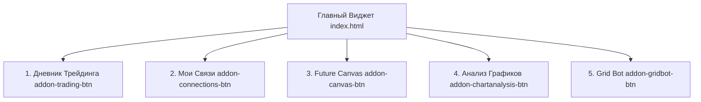

# Руководство по архитектуре и визуальной стилизации (OPERATIONS.md)

Данный документ содержит полное описание архитектуры, компонентов и визуального оформления Goals Widget. Он создан специально для того, чтобы сторонние разработчики и AI-агенты могли быстро сориентироваться в проекте, изменить стилизацию или сверстать новые визуальные элементы без риска сломать логику бэкенда.

---

## 1. Общая архитектура системы

Goals Widget представляет собой настольное приложение на базе **Electron** с мультиоконной структурой:
- **Главный процесс (Electron)** (`main.js`): управляет созданием окон, регистрирует обработчики межпроцессного взаимодействия (IPC), следит за файлами Obsidian, запускает фоновые Python-бэкенды и выключает их при выходе.
- **Мост IPC** (`preload.js`): безопасно пробрасывает функции Node.js и системные вызовы во фронтенд под объектом `window.electronAPI`.
- **Рендереры (Окна)**: Обычные веб-страницы (HTML/JS/CSS или JSX), отображаемые внутри фреймов Electron.

---

## 2. Карта окон и приложений

На панели дополнений (`addons-panel`) в главном виджете теперь размещены **5 кнопок запуска** для следующих модулей:



### 1. Дневник трейдинга (Trading Journal)
* **Иконка**: `📈`
* **Файлы интерфейса**: [frontend.html](file:///d:/Documents/Programming/Goals_Wiget/app/frontend.html), [trading-journal.jsx](file:///d:/Documents/Programming/Goals_Wiget/app/trading-journal.jsx)
* **Как работает**: React-компонент, рендерящийся прямо в окне Electron. Использует локальное хранилище сделок в JSON и подгружает текущие цены акций/фьючерсов через API Т-Банка (через IPC в `main.js`).
* **База данных**: Файл `D:\GoogleDisk\Docs\TradingDiary\trades.json`.
* **Стилизация**: Стили зашиты в JSX и в самом файле `frontend.html`. Дизайн выдержан в строгой темной гамме с тонкими границами.

### 2. Мои связи / Картотека (Connections)
* **Иконка**: `🤝`
* **Файлы интерфейса**: [connections.html](file:///d:/Documents/Programming/Goals_Wiget/app/connections.html), [connections.js](file:///d:/Documents/Programming/Goals_Wiget/app/connections.js)
* **Как работает**: Органайзер контактов и персональных связей, интегрированный с Obsidian. Отображает Markdown-файлы контактов из папки Obsidian. Поддерживает автогенерацию ID вида `PER-XXX` и кликабельные Wiki-ссылки вида `[[Имя Контакта]]`.
* **База данных**: Текстовые `.md` файлы в папке `C:\Users\HomePC\Documents\Obsidian\Progects\MyLife\Моя картотека`.
* **Стилизация**: Серый минималистичный дизайн, использующий полупрозрачность (`rgba`), размытие фона (`backdrop-filter`) и CSS-переменные для адаптации под тему основного окна.

### 3. Future Canvas / Карта будущего
* **Иконка**: `🌌`
* **Файлы интерфейса**: [future-canvas.html](file:///d:/Documents/Programming/Goals_Wiget/app/future-canvas/future-canvas.html), [future-canvas.js](file:///d:/Documents/Programming/Goals_Wiget/app/future-canvas/future-canvas.js)
* **Как работает**: Интерактивный бесконечный холст в стиле TradingView. Отображает ось времени, на которой пользователь размещает узлы событий, решений и целей.
* **База данных**: JSON-файлы досок в `app/future-canvas/boards/`.
* **Стилизация**: Футуристичный дизайн с неоновыми связями (линиями Безье) и зумом.

### 4. Анализ графиков (Chart Analysis — бывший AlgoTrading)
* **Иконка**: `📊`
* **Папка модуля**: [app/ChartAnalysis/](file:///d:/Documents/Programming/Goals_Wiget/app/ChartAnalysis)
* **Файлы интерфейса**: [frontend.html](file:///d:/Documents/Programming/Goals_Wiget/app/ChartAnalysis/frontend.html)
* **Бэкенд**: Python FastAPI сервер в [backend.py](file:///d:/Documents/Programming/Goals_Wiget/app/ChartAnalysis/backend.py), запускаемый на порту `8765`.
* **Как работает**: Подключается по WebSocket к биржевому потоку, анализирует японские свечи, рассчитывает развороты Heikin Ashi и отправляет Windows-уведомления при достижении ценовых алертов. **Функции автоторгового робота из этого бэкенда отключены.**
* **База данных**: Локальные базы SQLite `registry.db`, `candles.db` и пользовательская `pricealert.db` в папке `data/`.
* **Стилизация**: Встроенные стили в `<style>` в `frontend.html`. Панель вкладок справа (`Алерты`, `Линии`, `Лог`) выполнена без лишних рамок.

### 5. Сеточный робот Grid Bot (Seller)
* **Иконка**: `🤖`
* **Папка модуля**: [app/Seller/](file:///d:/Documents/Programming/Goals_Wiget/app/Seller)
* **Веб-интерфейс (UI)**: React Vite приложение в папке [dashboard-ui/](file:///d:/Documents/Programming/Goals_Wiget/app/Seller/dashboard-ui)
* **Бэкенд**: Python-скрипт [main.py](file:///d:/Documents/Programming/Goals_Wiget/app/Seller/main.py) (запускаемый через [run_local.py](file:///d:/Documents/Programming/Goals_Wiget/app/Seller/run_local.py)).
* **Архитектура портов**:
  - **Входной веб-интерфейс (Vite)**: порт **`8080`** (хост `0.0.0.0` для внешнего доступа).
  - **Бот-API (FastAPI)**: порт **`8000`** (хост `0.0.0.0`).
  - **API Движения капитала (CashFlow)**: порт **`8001`** (хост `0.0.0.0`).
* **Как работает**: Бот запускается скрытно при старте Electron через Python. Он совершает сеточные ордера (LONG/SHORT) на счетах Tinkoff в реальном времени. Встроенный сервер Vite на порту `8080` проксирует запросы на порты `8000` и `8001`, предоставляя единый терминал управления.
* **База данных**: Локальные JSON-файлы состояния в `app/Seller/data/`.
* **Стилизация**: Полноценный современный дашборд с использованием **React, TypeScript и Tailwind CSS** для адаптивной верстки.

---

## 3. Гайдлайн для изменения визуального оформления (Стилизация)

Если вам (или другому AI-агенту) поручено изменить дизайн или верстку окон, следуйте этим правилам:

### Правило 1. Использование CSS-переменных в Главном Виджете
Главное окно (`index.html`) стилизовано в файле [styles.css](file:///d:/Documents/Programming/Goals_Wiget/styles.css). Оно поддерживает смену тем (светлая/темная) и цветов-акцентов (зеленый, синий, фиолетовый и т.д.), динамически меняя CSS-переменные в `:root` или `.theme-light`.
* **Основные переменные**:
  - `--bg-dark` — основной черный/серый фон виджета.
  - `--bg-card` — фон карточек (цель, капитал, задачи).
  - `--border-color` — тонкие рамки.
  - `--accent-color` — выбранный пользователем цвет выделения (задается через палитру настроек).
  - `--text-main` — цвет основного текста.
* **Как менять визуал**: Чтобы обновить стиль главного виджета, меняйте переменные или дописывайте классы в `styles.css`. Не используйте жестко заданные цвета (`#ff0000`) в верстке — всегда ссылайтесь на `var(--accent-color)` и другие токены.

### Правило 2. Стилизация виджета «Мои связи»
Связи оформлены в серой гамме, гармонирующей с основным виджетом. Изменять стили нужно в [connections.html](file:///d:/Documents/Programming/Goals_Wiget/app/connections.html#L38) в блоке `<style>`. Применяйте стеклянный эффект (Glassmorphism) с помощью `backdrop-filter: blur(12px)`.

### Правило 3. Изменение интерфейса Grid Bot (dashboard-ui)
Интерфейс робота Grid Bot написан на React.
* **Где находятся компоненты**: [app/Seller/dashboard-ui/src/pages/](file:///d:/Documents/Programming/Goals_Wiget/app/Seller/dashboard-ui/src/pages/) и [components/](file:///d:/Documents/Programming/Goals_Wiget/app/Seller/dashboard-ui/src/components/).
* **Настройка стилей**: Используется **Tailwind CSS**. Файл конфигурации: [tailwind.config.ts](file:///d:/Documents/Programming/Goals_Wiget/app/Seller/dashboard-ui/tailwind.config.ts). Основные глобальные стили лежат в `src/index.css`.
* **Как запустить для отладки визуализации**:
  1. Откройте терминал в папке `app/Seller/dashboard-ui`.
  2. Выполните команду `npm install` (если зависимости еще не установлены).
  3. Запустите dev-сервер: `npm run dev`.
  4. Откройте `http://localhost:8080` в браузере для просмотра изменений на лету (HMR).

### Правило 4. Не нарушайте разметку Markdown в Obsidian-компонентах
В виджетах задач и контактов текст Markdown парсится динамически. Убедитесь, что любые изменения в CSS-стилях списков (классы `.task-item`, `.checkbox`, `.wiki-link`) не мешают JS-скриптам находить чекбоксы и реагировать на клики.

---

## 4. Схема проксирования портов в Grid Bot

При доработке веб-интерфейса Grid Bot важно понимать, как устроено сетевое взаимодействие. Запросы с фронтенда отправляются по относительным путям (`/api/...`), а Vite-сервер перенаправляет их на локальные порты согласно файлу [vite.config.ts](file:///d:/Documents/Programming/Goals_Wiget/app/Seller/dashboard-ui/vite.config.ts):

```
Браузер (Внешний доступ: http://<WHITE_IP>:8080)
      │
      ▼
Vite Dev Server (порт 8080, слушает на 0.0.0.0)
      │
      ├─► Запросы интерфейса (JS, HTML, CSS) ──► Возвращаются в браузер
      │
      ├─► /api/* ─────────► Прокси на http://127.0.0.1:8000 (FastAPI Bot Engine)
      │
      └─► /stats/*, /logs/*, /months/*, etc. ──► Прокси на http://127.0.0.1:8001 (CashFlow API)
```

Благодаря этой схеме, для полноценного удаленного управления Grid Bot через роутер достаточно открыть наружу **только один порт 8080**, на котором крутится Vite-сервер.
